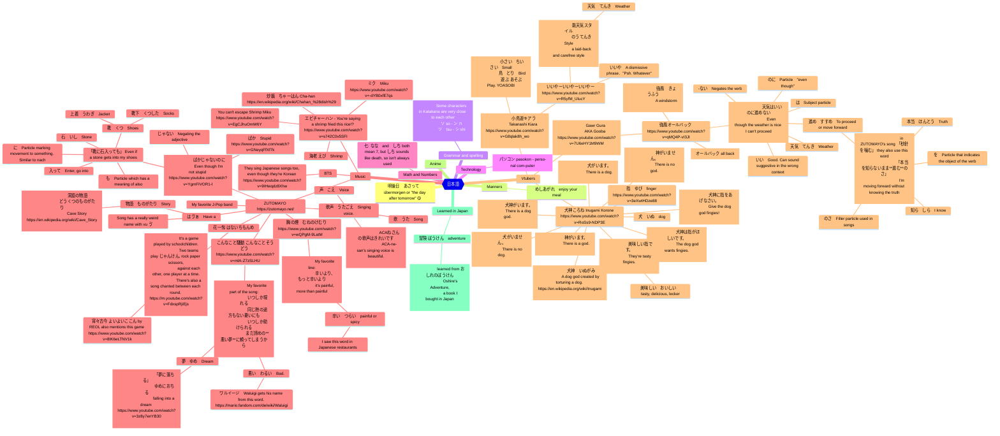

A place for me to document my Japanese knowledge, based on the context I learned
words from.

<!--more-->

You can drag the chart around!

```mermaid
mindmap
    {{日本語}}
    ::icon(fa fa-circle)
        明後日　あさって　übermorgen or "the day after tomorrow" 😋
        Manners
            めしあがれ　enjoy your meal
        Grammar and spelling
            [
                Some characters in Katakana are very close to each other
                ソ so - ン ｎ
                ツ　tsu - シ shi
            ]
        Technology
            [パソコン pasokon - perso-nal com-puter]
        Math and Numbers
            七: なな　and　しち both mean 7, but しち sounds like death, so isn't always used
        Music
            エビチャーハン - You're saying a shrimp fried this rice!? https://www.youtube.com/watch?v=s742C0v5SFI
                You can't escape Shrimp Miku https://www.youtube.com/watch?v=EgCJhuOmW6Y
                海老 えび　Shrimp
                ミク　Miku https://www.youtube.com/watch?v=-dYB0xfE7qs
                炒飯　ちゃーはん Cha-han https://en.wikipedia.org/wiki/Chahan_%28dish%29
            ZUTOMAYO https://zutomayo.net/
                歌声　うたごえ　Singing voice.
                    声　こえ　Voice
                    歌　うた　Song
                    [
                        ACAねさんの歌声はきれいです
                        ACA-ne-san's singing voice is beautiful.
                    ]

                My favorite J-Pop band
                はゔぁ　Have a
                    Song has a really weird name with vu ゔ
                    物語　ものがたり　Story
                        [
                            洞窟の物語
                            どうくつのものがたり
                            Cave Story https://en.wikipedia.org/wiki/Cave_Story
                        ]
                胸の煙　むねのけむり https://www.youtube.com/watch?v=wQPgM-9LatM
                    [
                        My favorite line:
                        辛いより、もっと辛いより
                        it's painful, more than painful
                    ]
                        辛い　つらい　painful or spicy
                            I saw this word in Japanese restaurants
                花一匁 はないちもんめ
                    [
                        It's a game played by schoolchildren.
                        Two teams play じゃんけん, rock paper scissors,
                        against each other, one player at a time.
                        There's also a song chanted between each round. https://m.youtube.com/watch?v=FdxspRjiEjs
                    ]
                        宵々古今 よいよいここん by REOL also mentions this game https://www.youtube.com/watch?v=8IK6eLTNV1k
                こんなこと騒動 こんなことそうどう https://www.youtube.com/watch?v=mlA-Z7zSLHU
                    [
                        My favorite part of the song:
                        いつしか現れる
                        同じ熱の途方もない憂いにも
                        いつしか助けられる
                        まだ諦めの**悪い夢**に頼ってしまうから
                    ]
                        悪い　わるい　Bad.
                            ワルイージ　Waluigi gets his name from this word. https://mario.fandom.com/de/wiki/Waluigi
                        夢　ゆめ　Dream
                            [
                                「夢に落ちる」
                                ゆめにおちる
                                falling into a dream https://www.youtube.com/watch?v=3z8y7enYB30
                            ]
                [
                    ばかじゃないのに
                    Even though I'm not stupid https://www.youtube.com/watch?v=YgmFIVOR1-I
                ]
                    ばか　Stupid https://www.youtube.com/watch?v=GNeyqFfXf7k
                    じゃない　Negating the adjective
                    「靴に石入っても」 Even if a stone gets into my shoes
                        靴　くつ　Shoes
                            靴下　くつした　Socks
                            上着　うわぎ　Jacket
                        に　Particle marking movement to something. Similar to nach
                        石　いし　Stone
                        入って　Enter, go into
                        も　Particle which has a meaning of also
            BTS
                They sing Japanese songs too, even though they're Korean https://www.youtube.com/watch?v=9IHwqdz8Xhw
        Vtubers
            [
                Gawr Gura
                AKA Gooba https://www.youtube.com/watch?v=7U6eHY1M9WM
            ]
                強風オールバック https://www.youtube.com/watch?v=qMQ4P-vI3JI
                    [
                        強風　きょうふう
                        A windstorm
                    ]
                    [
                        オールバック
                        all back
                    ]
                    [
                        天気はいいのに進めない
                        Even though the weather is nice I can't proceed
                    ]
                        天気　てんき　Weather
                        は　Subject particle
                        いい　Good. Can sound suggestive in the wrong context
                        のに　Particle　"even though"
                        -ない　Negates the verb
                        進め　すすめ　To proceed or move forward
                            [
                                in ZUTOMAYO's song 「秒針を噛む」 they also use this word
                                「本当を知らないまま**進む**のさ」
                                I'm moving forward without knowing the truth
                            ]
                                本当　ほんとう　Truth
                                を　Particle that indicates the object of the verb
                                知ら　しら　I know
                                のさ　Filler particle used in songs


            [
                小鳥遊キアラ
                Takanashi Kiara https://www.youtube.com/watch?v=G8qlak8h_wo
            ]
                [
                    小さい　ちいさい　Small
                    鳥　とり　Bird
                    遊ぶ あそぶ Play. YOASOBI
                ]
                いいやーいいやーいいやー https://www.youtube.com/watch?v=R5yfM_UlucY
                    いいや　A dismissive phrase．"Psh. Whatever"
                    [
                        能天気スタイル
                        のうてんき Style
                        a laid-back and carefree style
                    ]
                        天気　てんき　Weather
            犬神ころね Inugami Korone https://www.youtube.com/watch?v=RoSs9-NDP3E
                [
                    犬神　いぬがみ
                    A dog god created by torturing a dog. https://en.wikipedia.org/wiki/Inugami
                ]
                指　ゆび　finger https://www.youtube.com/watch?v=3eXwtHDze88
                犬　いぬ　dog
                [
                    犬がいます。
                    There is a dog.
                ]
                [
                    犬がいません。
                    There is no dog.
                ]
                [
                    神がいます。
                    There is a god.
                ]
                [
                    神がいません。
                    There is no god.
                ]
                [
                    犬神がいます。
                    There is a dog god.
                ]
                [
                    犬神は指がほしいです。
                    The dog god wants fingies.
                ]
                [
                    犬神に指をあげなさい。
                    Give the dog god fingies!
                ]
                [
                    美味しい指です。
                    They're tasty fingies.
                ]
                    美味しい　おいしい　tasty, delicious, lecker
        Anime
        Learned in Japan
            冒険 ぼうけん　adventure
                [
                    learned from おしれのぼうけん
                    Oshire's Adventure,
                    a book I bought in Japan
                ]
```