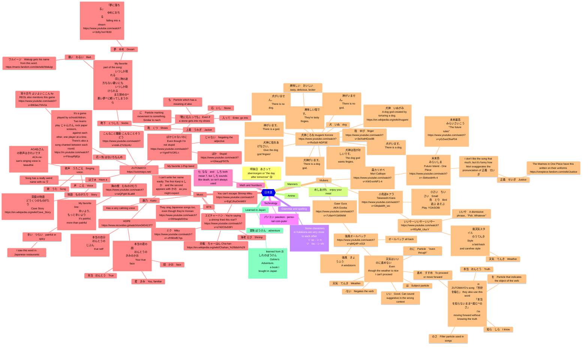

A huge mind map of all the Japanese I've learned, broken down by where the words came from.

<!--more-->

You can drag the chart around!

[Reset to center](#mm-nihongo)

```mermaid
mindmap
    {{日本語}}
    ::icon(fa fa-circle)
    :::mm-nihongo
        明後日　あさって　übermorgen or "the day after tomorrow" 😋
        :::mm-uebermorgen
        Manners
        :::mm-manners
            めしあがれ　enjoy your meal
            :::mm-enjoy
        Grammar and spelling
        :::mm-grammar
            [
                Some characters in Katakana are very close to each other
                ソ so - ン ｎ
                ツ　tsu - シ shi
            ]
            :::mm-sontsushi
        Technology
        :::mm-tech
            [パソコン pasokon - perso-nal com-puter]
            :::mm-pasokon
        Math and Numbers
        :::mm-math
            七: なな　and　しち both mean 7, but しち sounds like death, so isn't always used
            :::mm-shichi
        Music
        :::mm-music
            鹿乃　Kano
            :::mm-kano
                I can't write her name easily. The first Kanji is しか　and the second appears with かの　as you might expect
                :::mm-kano-kanji
                Has a very calming voice
                :::mm-kano-desc
                HOPE https://www.nicovideo.jp/watch/sm34341377
                :::mm-kano-hope
                    [
                        本当の君の顔
                        ほんとうのきみのかお
                        Your true face
                    ]
                    :::mm-kano-hontou-no-kimi-no-kao
                        君　きみ　You, familiar
                        :::mm-kano-kimi
                        本当　ほんとう　True
                        :::mm-kano-hontou
                        顔　かお　face
                        :::mm-kano-kao
                    [
                        本当の自分
                        ほんとうのじぶん
                        true self
                    ]
                    :::mm-kano-hontou-no-jibun
            エビチャーハン - You're saying a shrimp fried this rice!? https://www.youtube.com/watch?v=s742C0v5SFI
            :::mm-youre-saying-a-shrimp-fried-this-rice
                You can't escape Shrimp Miku https://www.youtube.com/watch?v=EgCJhuOmW6Y
                :::mm-shrimp-miku-sees-you-when-youre-sleeping
                海老 えび　Shrimp
                :::mm-ebi
                ミク　Miku https://www.youtube.com/watch?v=-dYB0xfE7qs
                :::mm-miku
                炒飯　ちゃーはん Cha-han https://en.wikipedia.org/wiki/Chahan_%28dish%29
                :::mm-cha-han
            ZUTOMAYO https://zutomayo.net/
            :::mm-zutomayo
                歌声　うたごえ　Singing voice.
                :::mm-utagoe
                    声　こえ　Voice
                    :::mm-koe
                    歌　うた　Song
                    :::mm-uta
                    [
                        ACAねさんの歌声はきれいです
                        ACA-ne-san's singing voice is beautiful.
                    ]
                    :::mm-acane-no-utagoe
                My favorite J-Pop band
                :::mm-liebe-zutomayo
                はゔぁ　Have a
                :::mm-hava
                    Song has a really weird name with vu ゔ
                    :::mm-vu
                    物語　ものがたり　Story
                    :::mm-monogatari
                        [
                            洞窟の物語
                            どうくつのものがたり
                            Cave Story https://en.wikipedia.org/wiki/Cave_Story
                        ]
                        :::mm-cavestory
                胸の煙　むねのけむり https://www.youtube.com/watch?v=wQPgM-9LatM
                :::mm-mune-no-kemuri
                    [
                        My favorite line:
                        辛いより、もっと辛いより
                        it's painful, more than painful
                    ]
                    :::mm-tsurai-yori
                        辛い　つらい　painful or spicy
                        :::mm-tsurai
                            I saw this word in Japanese restaurants
                            :::mm-tsurai-spotted
                花一匁 はないちもんめ
                :::mm-hana-ichi-monme
                    [
                        It's a game played by schoolchildren.
                        Two teams play じゃんけん, rock paper scissors,
                        against each other, one player at a time.
                        There's also a song chanted between each round. https://m.youtube.com/watch?v=FdxspRjiEjs
                    ]
                    :::mm-hana-ichi-monme-desc
                        宵々古今 よいよいここん by REOL also mentions this game https://www.youtube.com/watch?v=8IK6eLTNV1k
                        :::mm-hana-yoiyoi-kokon
                こんなこと騒動 こんなことそうどう https://www.youtube.com/watch?v=mlA-Z7zSLHU
                :::mm-konna-koto-soudou
                    [
                        My favorite part of the song:
                        いつしか現れる
                        同じ熱の途方もない憂いにも
                        いつしか助けられる
                        まだ諦めの**悪い夢**に頼ってしまうから
                    ]
                    :::mm-endless-sorrow
                        悪い　わるい　Bad.
                        :::mm-warui
                            ワルイージ　Waluigi gets his name from this word. https://mario.fandom.com/de/wiki/Waluigi
                            :::mm-waruigi
                        夢　ゆめ　Dream
                        :::mm-yume
                            [
                                「夢に落ちる」
                                ゆめにおちる
                                falling into a dream https://www.youtube.com/watch?v=3z8y7enYB30
                            ]
                            :::mm-yume-ni-ochiru
                [
                    ばかじゃないのに
                    Even though I'm not stupid https://www.youtube.com/watch?v=YgmFIVOR1-I
                ]
                :::mm-baka-janai-noni
                    ばか　Stupid https://www.youtube.com/watch?v=GNeyqFfXf7k
                    :::mm-baka
                    じゃない　Negating the adjective
                    :::mm-janai
                    「靴に石入っても」 Even if a stone gets into my shoes
                    :::mm-kutsu-ni-ishi
                        靴　くつ　Shoes
                        :::mm-kutsu
                            靴下　くつした　Socks
                            :::mm-kutsushita
                            上着　うわぎ　Jacket
                            :::mm-uwagi
                        に　Particle marking movement to something. Similar to nach
                        :::mm-ni
                        石　いし　Stone
                        :::mm-ishi
                        入って　Enter, go into
                        :::mm-haitte
                        も　Particle which has a meaning of also
                        :::mm-mo
            BTS
            :::mm-bts
                They sing Japanese songs too, even though they're Korean https://www.youtube.com/watch?v=9IHwqdz8Xhw
                :::mm-bts-japanese-korean
        Vtubers
        :::mm-vtubers
            [
                森カリオペ
                Mori Calliope https://www.youtube.com/watch?v=XW3-enNF1-4
            ]
            :::mm-mori-calliope
                [
                    未来島
                    みらいしま
                    Future Island - One Piece https://www.youtube.com/watch?v=-Sb4wxbHh-4
                ]
                :::mm-mirai-shima
                    [
                        未来最高
                        みらいさいこう
                        "The future rules" https://www.youtube.com/watch?v=yGZwsO5wF04
                    ]
                    :::mm-mirai-saikou
                    I don't like the song that much, but it's funny how Mori exaggerates the pronunciation of 正義　せいぎ
                    :::mm-seigi-exaggerate
                        正義　せいぎ　Justice
                        :::mm-seigi
                            The Marines in One Piece have this written on their uniforms https://onepiece.fandom.com/wiki/Justice
                            :::mm-marine-seigi
            [
                Gawr Gura
                AKA Gooba https://www.youtube.com/watch?v=7U6eHY1M9WM
            ]
            :::mm-gooba
                強風オールバック https://www.youtube.com/watch?v=qMQ4P-vI3JI
                :::mm-gooba-kyoufuu
                    [
                        強風　きょうふう
                        A windstorm
                    ]
                    :::mm-starkwind
                    [
                        オールバック
                        all back
                    ]
                    :::mm-orubakku
                    [
                        天気はいいのに進めない
                        Even though the weather is nice I can't proceed
                    ]
                    :::mm-tenki-wa-ii-noni-susumenai
                        天気　てんき　Weather
                        :::mm-tenki
                        は　Subject particle
                        :::mm-ha
                        いい　Good. Can sound suggestive in the wrong context
                        :::mm-ii
                        のに　Particle　"even though"
                        :::mm-noni
                        -ない　Negates the verb
                        :::mm-nai
                        進め　すすめ　To proceed or move forward
                        :::mm-susume
                            [
                                in ZUTOMAYO's song 「秒針を噛む」 they also use this word
                                「本当を知らないまま**進む**のさ」
                                I'm moving forward without knowing the truth
                            ]
                            :::mm-zutomayo-forward-truth
                                本当　ほんとう　Truth
                                :::mm-hontou
                                を　Particle that indicates the object of the verb
                                :::mm-wo
                                知ら　しら　I know
                                :::mm-shira
                                のさ　Filler particle used in songs
                                :::mm-nosa


            [
                小鳥遊キアラ
                Takanashi Kiara https://www.youtube.com/watch?v=G8qlak8h_wo
            ]
            :::mm-takanashi-kiara
                [
                    小さい　ちいさい　Small
                    鳥　とり　Bird
                    遊ぶ あそぶ Play. YOASOBI
                ]
                :::mm-small-bird-play
                いいやーいいやーいいやー https://www.youtube.com/watch?v=R5yfM_UlucY
                :::mm-iiya-song
                    いいや　A dismissive phrase．"Psh. Whatever"
                    :::mm-iiya-word
                    [
                        能天気スタイル
                        のうてんき Style
                        a laid-back and carefree style
                    ]
                    :::mm-noutenki-style
                        天気　てんき　Weather
                        :::mm-tenki-2
            犬神ころね Inugami Korone https://www.youtube.com/watch?v=RoSs9-NDP3E
            :::mm-inugami-korone
                [
                    犬神　いぬがみ
                    A dog god created by torturing a dog. https://en.wikipedia.org/wiki/Inugami
                ]
                :::mm-inugami
                指　ゆび　finger https://www.youtube.com/watch?v=3eXwtHDze88
                :::mm-yubi
                犬　いぬ　dog
                :::mm-inu
                [
                    犬がいます。
                    There is a dog.
                ]
                :::mm-inu-yes
                [
                    犬がいません。
                    There is no dog.
                ]
                :::mm-inu-no
                [
                    神がいます。
                    There is a god.
                ]
                :::mm-kami-yes
                [
                    神がいません。
                    There is no god.
                ]
                :::mm-kami-no
                [
                    犬神がいます。
                    There is a dog god.
                ]
                :::mm-inugami-yes
                [
                    犬神は指がほしいです。
                    The dog god wants fingies.
                ]
                :::mm-inugami-yubi-hoshii
                [
                    犬神に指をあげなさい。
                    Give the dog god fingies!
                ]
                :::mm-inugami-yubi-agenasai
                [
                    美味しい指です。
                    They're tasty fingies.
                ]
                :::mm-oishii-yubi
                    美味しい　おいしい　tasty, delicious, lecker
                    :::mm-oishii
        Anime
        :::mm-anime
        Learned in Japan
        :::mm-nihon-ni
            冒険 ぼうけん　adventure
            :::mm-bouken
                [
                    learned from おしれのぼうけん
                    Oshire's Adventure,
                    a book I bought in Japan
                ]
                :::mm-oshire-no-bouken
```